= Advanced Software Engineering - Dokumentation
:toc:
:toc-placement: preamble
:toclevels: 4

Hiermit erkläre ich, dass ich die vorliegende Arbeit selbstständig verfasst habe.

== pump

Mit der pump Desktopanwendung lassen sich einfach persönliche Trainingspläne erstellen.
Das eigene Training lässt sich individuell gestalten, ohne dabei abhängig von Übungsangeboten von etablierten Anbietern zu sein.

=== Grundlagen

//TODO zu dieser arbeit: bearbeitungen in der reihenfolger der doku vorgenommen, klassen heißen vorne ganz anders als hinten und haben andere strukturen

==== Verwendete Bibliotheken

Neben Java wurden für den Programmentwurf JavaFX, JUnit und Mockito verwendet.
// hier am besten noch Links auf die Projekte reinmachen
In diesem Abschnit wird erläutert warum gerade diese.

===== JavaFX

JavaFX ist eine Java-Spezifikation von Oracle.
Es ist ein Framework zur Erstellung grafischer Desktopanwendungen.
Es löst AWT und Swing als Quasistandard ab.

Mit JavaFX ist das Erstellen grafischer Anwendungen erleichtet und die Anwendungen sind nativ plattformübergreifend.
Außerdem ensteht beim Entwickeln mit JavaFX quasi automatisch eine Schichtenarchitektur.

===== JUnit

JUnit ist ein gängiges Testframework für Java Anwendungen.
Es eignet sich für Automatisierung von Tests, beziehungsweise nimmt es einem ab.

===== Mockito

Mockito ist eine etablierte Programmbibliothek zur Erstellung von Mock-Objekten für Java Unittests.

==== Aufbau

===== Persistenz

Die Persistenz der Daten erfolgt durch die Verwendung des _javax.xml.bind.*_ Moduls quasi automatisch.
In der Klasse `Databasis` sind die zu persistierenden Objekte vorgehalten, strukturiert und mit Annotations versehen.

.Databasis.java
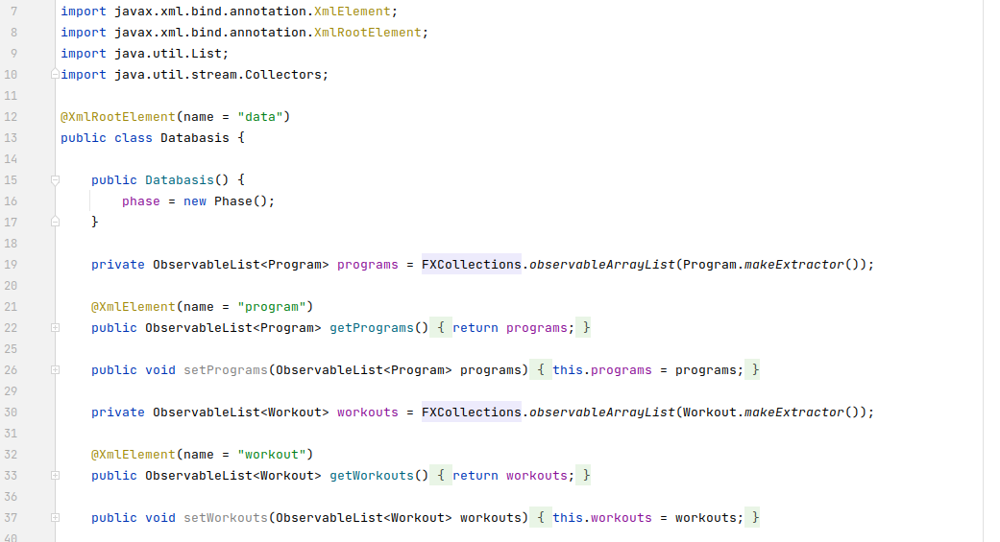

In `Database` erfolgt dann die Persistierung der `Databasis` in einem XML File und umgekehrt die Erstellung einer `Databasis` aus einem XML File.

.Database.java
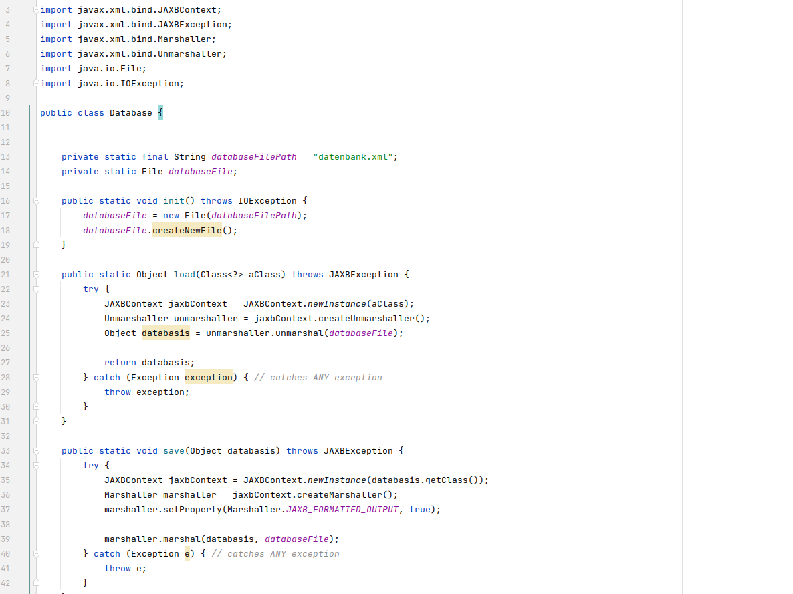

Die Persistierung per XML wurde gewählt, da keine allzu großen Datenmengen anfallen und nicht viele oder komplizierte Beziehungen zwischen Objekten bestehen.
Verweise auf andere Objekte sind mit einer einfachen Annotation im referenzierenden Objekt und einer eindeutigen Identifikationsnummer als String im referenzierten Objekt umgesetzt.

.Workout.java
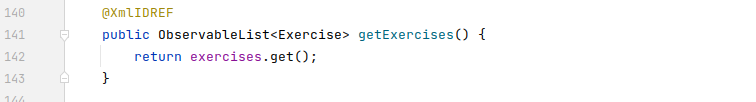
.Exercise.java
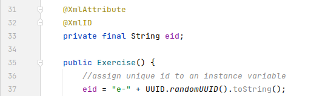

===== JavaFX Beans

Die Member von Domainklassen sind mittels Beans umgesetzt.
Beans erlauben einem, Member direkt an UI-Elemente zu binden.
So kann zum Beispiel der Name einer Übung bidirektional an ein entsprechendes Textfeld gebunden werden.
Ändert sich der Wert des Namen, wird der Inhalt des Textfeldes angepasst und umgekehrt.

Des Weiteren liefert das _javafx.beans.*_ Modul die Observable-Funktionalität, mit der man die Domainobjekte beobachtbar machen kann.
Dadurch können `ObservableLists<DomainObjekt>` ebenso an UI-Elemente gebunden werden und so beispielsweise ``ListView``s aktuell gehalten werden.

===== fxml und Controller

Um die Benutzeroberfläche zu entwerfen wurden fxml Dateien verwendet.
Mit ihnen lassen sich einfach Grundstrukturen und permanente Elemente, also Elemente die nicht zur Laufzeit variabel erscheinen können, entwerfen.
Außerdem lassen sich fxml Dateien einfach in einem Scenebuilder interaktive Entwerfen.
Jedem fxml File ist ein verantwortlicher Controller zugeteilt.
Der Controller übernimmt die Steuerung der UI-Elemente und Szenen sowie die Bearbeitung der Nutzeraktionen, also Eingaben oder Klicks.

=== Programmierprinzipien

==== SOLID

SOLID ist ein Akronym für fünf Programmierprinzipien, die bei Einhaltung zu besserer Lesbarkeit, Wartbarkeit und Lebensdauer von Software führen.

===== Single-responsibility principle

Für meine Klasse `Datenbank` gab es mehrere Gründe, sie zu bearbeiten.
Ein Grund wäre eine Veränderung der `Datenbasis`, ein weiterer eine Änderung der Routine beim Speichern oder Laden der Daten.

.Datenbank.java before
image::doc/screenshots/Datenbank_0.png[]

Um nun das single-responsibility Prinzip umzusetzen wird die Logik der Datenbasis aus der Klasse extrahiert.
Die `Datenbank` Klasse lädt und speichert nun lediglich eine `Datenbasis`.
Die Struktur der Datenbasis befindet sich in der Klasse `Datenbasis`.

.Datenbank.java after
image::doc/screenshots/Datenbank_1_1.png[]

Hier der zugehörige link:https://github.com/zeno420/pump/commit/55e2463a3013b87e0f49d280a61823e3f4b1fb3b[commit].

===== Open–closed principle

Ein Programm enthält veränderbare Member, wie den Namen, die Beschreibung und die Liste der Tage.
Im `ProgrammController` wird beim Drücken des Speicherknopfes die Methode `programmSpeichern()` aufgerufen.
Diese überprüft die Member des beim Start des Bearbeiten oder Erstellen eines Programms erzeugten temporären Programms auf Korrektheit und überträgt die Werte der Member anschließend auf das tatsächliche Programm. (Zeilen 100 bis 102)

.ProgrammController.java beofre
image::doc/screenshots/programmSpeichern_0.png[]

Wollte man einem `Programm` einen weiteren Member hinzufügen, so müsste auch diese Stelle im Code überarbeitet werden.
Um das open-closed Prinzip hier zu unserem Vorteil zu nutzen, wird in der Klasse `Programm` eine Liste erzeugt, welche alle änderbaren Member beinhaltet, also alle, auf die beim Erstellen oder Bearbeiten zugegriffen werden.

.Programm.java
image::doc/screenshots/programmSpeichern_1_3.png[]
.Programm.java
image::doc/screenshots/programmSpeichern_1_4.png[]

Eine neue Methode `aenderbareMemberUebertragen(List<Property> tmpAenderbareMember)` iteriert nun über all diese Felder und überträggt die Werte.

.Programm.java
image::doc/screenshots/programmSpeichern_1_2.png[]

In `programmSpeichern()` muss nun nur noch die Methode zum Übertragen aufgerufen werden.

.ProgrammController.java after
image::doc/screenshots/programmSpeichern_1_1.png[]

Somit kann in `Programm` einfach die Liste der Member erweitert werden ohne `programmSpeichern()` im `ProgrammController` ändern zu müssen.
Hier der zugehörige link:https://github.com/zeno420/pump/commit/7f2e49c88027a5826853e37daa7ffb2067a33d93[commit].

===== Liskov substitution principle

Das Liskovsche Substitutionsprinzip ist erfüllt, da alle Klassen, die von anderen Klassen erben dies nicht per abstrakten Klassen und/oder _extends_ vollziehen, sondern nur einstufig Interfaces implementieren.
Da in einem Interface noch keine Implementierung von Methoden erfolgt, können keine Logikwiedersprüche enstehen.
Durch das Ersetzen einer Oberklasse durch eine Unterklasse kann also nicht das Verhalten des Programms verändert werden.
In dem Fall meiner spezialisierten ``ListCell``s wird zwar von `ListCell` geerbt, jedoch erfolgt diese Vererbung parametrisiert.
Es ließe sich also syntaktisch keine DayCell an einer Stelle verwenden, an der zuvor eine generische ListCell verwendet wurde.

.DayCell.java
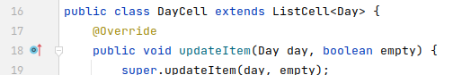

===== Interface segregation principle

Die Domainklasse `Exercise` implementiert die Interfaces `EditableDomainObject` und `UniqueNamed`.
Die beiden Interfaces liegen logisch relativ nah beieinander und man könnte nun also denken wieso steckt die Logik des eindeutigen Namens nicht mit im EditabeDomainObject?
Die Domainklasse `Set` ist (theoretisch, zum Stand der Abgabe leider noch nicht umgesetzt) auch ein `EditableDomainObject`, muss aber keinen eindeutigen Namen haben.
Um der Klasse `Set` diese Funktionalität nicht aufzuzwingen, ergeben sich die beiden getrennten Interfaces.
Die Klasse `Exercise` implementiert dann eben beide Interfaces.

.Exercise.java
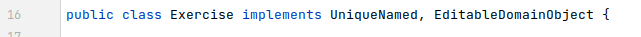
.UniqueNamed.java
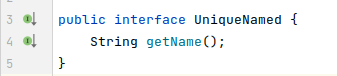
.EditableDomainObject.java
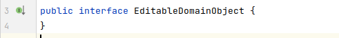

===== Dependency inversion principle

In der `Statistik` Klasse gibt es Methoden, die Listen von Logeinträgen nach gewissen Kriterien zusammenfassen.
Initial mit einer `ObservableList` als Parameter.

.Statistik.java before
image::doc/screenshots/StatistikDI_0.png[]

Dependency inversion fordert, dass auf das abstrakteste Level abgestuft wird.
Die Methoden werden jetzt also mit `List` als Parameter aufgerufen.

.Statistik.java after
image::doc/screenshots/StatistikDI_1_1.png[]

==== GRASP

General Responsibility Assignment Software Patterns (GRASP) ist eine Menge von Entwurfsmustern, die die Zuständigkeit bestimmter Klassen objektorientierter Systeme festlegen.

===== Low Coupling

Das Abspeichern einer Übung fand im `UebungController` statt.

.UebungController.java before
image::doc/screenshots/LowCoupling_0_2.png[]

Dort brauchte es Wissen aus der `Uebung` Klasse

.Uebung.java before
image::doc/screenshots/LowCoupling_0_3.png[]

und eine Liste mit Namen der bereits existierenden Übungen.

.UebungController.java before
image::doc/screenshots/LowCoupling_0_1.png[]

Die Verantwortung zum Abspeichern, also die Übung in die Datenbasis eintragen, liegt eher bei der Datenbasis selbst.

.Datenbasis.java before
image::doc/screenshots/LowCoupling_1_1.png[]

In der Datenbasis ist ebenfalls das Wissen über die bereits existierenden Übungen, also wird hier die Namenskollision geprüft.

.Datenbasis.java before
image::doc/screenshots/LowCoupling_1_2.png[]

Im Controller wird nun nur noch die `hinzufügen()` und `updaten()` Methode aufgerufen.

.UebungController.java after
image::doc/screenshots/LowCoupling_1_4.png[]

Die Validierung innerhalb der Übung selbst beinhaltet nur noch die Prüfungen, die auf internem Wissen der Übung basieren.

.Uebung.java after
image::doc/screenshots/LowCoupling_1_3.png[]

Hier der zugehörige link:https://github.com/zeno420/pump/commit/e28d6914da42028e8ae67a6eacfa08adb5d58ee4[commit].

===== High Cohesion

Um die Kohäsion zu steigern soll beispielsweise vermieden werden, einer Domainklasse semantisch zu weit enfernten Code hinzuzufügen.
In der Klasse `EintragCount` befand sich die Methode `keyLexikographischKleiner()`,

.EintragCount.java
image::doc/screenshots/HighCohesion_0_1.png[]

die in der `Statistik` Klasse dazu verwendet wurde, den Eintrag mit dem frühsten Datum zu ermitteln.

.Statistik.java before
image::doc/screenshots/HighCohesion_0_2.png[]

Diese Funktionalität wird in einen Comparator namens `EintragCountKeyComparator` ausgelagert.

.EintragCountKeyComparator.java
image::doc/screenshots/HighCohesion_1_2.png[]

Mit diesem Comparator wird anschließend die Liste Sortiert und auf das Element mit dem Index 0 zugegriffen.

.Statistik.java after
image::doc/screenshots/HighCohesion_1_1.png[]

Um Listen von `EintragCount` nach weiteren Kriterien zu sortieren muss nun lediglich ein entsprechender Comparator hinzugefügt werden.
Hier der zugehörige link:https://github.com/zeno420/pump/commit/540f6c38374af922ae780dac809f66685cfa15e6[commit].

==== DRY

Oft integrieren IDEs statische Codeanalyse.
Bei IntelliJ IDEA ist dies der Fall.
Diese Analyse zeigt einem einige Stellen auf, an denen duplicated Code existiert.
Dies ist in dem nachfogenden Bild in Zeile 82, als eine graue Unterkringelung, zu sehen.

.RootController.java before
image::doc/screenshots/DRYDeleteAlert_0_1.png[]

Der Code wiederholt sich ab Zeile 158.

.RootController.java before
image::doc/screenshots/DRYDeleteAlert_0_2.png[]

In manchen Fällen wird sogar eine automatische Extraktion des Codestückes geboten.

image::doc/screenshots/DRYDeleteAlert_0_3.png[]

Das Codestück wird in die `customizeDeleteAlert()`-Methode ausgelagert und die variablen Teile übergeben.

.RootController.java after
image::doc/screenshots/DRYDeleteAlert_1_3.png[]

Diese Methode wird nun an den Stellen aufgerufen, wo vorher gleicher Code stand.

.RootController.java after
image::doc/screenshots/DRYDeleteAlert_1_1.png[]
.RootController.java after
image::doc/screenshots/DRYDeleteAlert_1_2.png[]

Wiederholungen von Code ziehen sich oft durch das ganze Projekt.
Vorangegangenes Beispiel war nur ein Fall von vielen.
Im Zuge des zugehörigen link:https://github.com/zeno420/pump/commit/ba45d2b46b9a109049c786512d07fc08af8861db[commits] wurde die Anzahl der Codezeilen von 2256 auf 2220 verringert.

=== Entwurfsmuster

==== Builder Pattern

Möchte man in der Startansicht der Anwendung ein neues Programm, Workout oder eine neue Übung erstellen, oder ein bestehendes Objekt bearbeiten, wird bei Drücken des entsprechenden Knopfes, im RootController die zugehörige Methode aufgerufen. Diese sechs verschiedenen Methoden folgen immer dem gleichen Schema: Ein neuer Dialog wird aus einer fxml Resource erstellt, ein Name für diesen Dialog gewählt und der für den Dialog zukünftig zuständige Controller mit dem zu bearbeitenden Objekt initialisiert (`setUpBindingEdit()`).
Vereinfacht gesagt, es wird immer der Editierdialog *gebaut*.
Hier bietet es sich an ein Entwurfsmuster vom Typ Erzeuger anzuwenden.
Genauer, das Builder Pattern.

Um aus den als Beispiel dienenden Methoden `programmBearbeiten()` und `programmErstellen()` den zusätzlich noch DRY verletzenden Dialogaufbaucode zu entfernen, wird eine neue Klasse, `EditDialogBuilder` erstellt.
Diese besitzt Member, die den zuvor zwischen `programmBearbeiten()` und `programmErstellen()` unterschiedlichen Aufrufen entsprechen.
Für diese Member gibt es Setter, die den Wert nicht nur setzen, sondern auch *this*, also den `EditDialogBuilder` wieder zurrückgeben.
Damit wird erreicht, dass die "Konfiguration" des Builders in einem verketteten Statement erfolgen kann.
Abschließend wird die funktion build() aufgerufen, die den Bau des Dialogs vornimmt.

Da für Workout und Übung die Routine nahezu identisch ist, wird jetzt der `EditDialogBuilder` noch generisch gemacht.
Dies bedarf des Hilfsinterfaces `EditableDomainObject`, welches von Programm, Workout und Übung implementiert wird und `SetupableController`, welches von Programm-, Workout-, und Übungscontroller implementiert wird.

Zuvor hängt der `RootController`, aus dem die Erstellen- und Bearbeiten-Methoden aufgerufen werden, noch von der `setUpBindingEdit()` Methode des Programm-, Workout-, und Übungscontrollers ab.

.before
image::doc/classdiagrams/Package_controller_builder_0.png[]
.before
image::doc/classdiagrams/Package_daten_builder_0.png[]

Nach der Implementierung des `EditDialogBuilders` hängt der `RootController` nur noch vom Builder ab.
Der Builder wiederum von der `setUpBindingEdit()` Methode eines ``SetupableController``s.
`EditableDomainObject` ist lediglich ein Markierungsinterface.
`SetupableController` stellt sicher, dass ein Controller über die `setUpBindingEdit()` Methode verfügt.

.after
image::doc/classdiagrams/Package_controller_builder_1.png[]
.after
image::doc/classdiagrams/Package_daten_builder_1.png[]

Die weiterhin bestehende Abhängigkeit des `RootController` auf den `ProgrammController` ist einer anderen Codestelle geschuldet.
In diesem link:https://github.com/zeno420/pump/commit/e564a17be6bebdf4caffedf6ed3861efed9a5167[commit] können alle, im Zuge der Implementierung des Builder Patterns für Programme, vorgenommenen Änderungen eingesehen werden.
In diesem link:https://github.com/zeno420/pump/commit/bd64481cd97d911d30e35034710d8595d6a9ebd9[commit] die Änderungen für die Generifizierung.

=== Domain Driven Design

==== Analyse der Ubiquitous Language

//FIXME ist das analyse?

In der Domäne Training oder auch Pumpen (*pump*) existieren Trainingsprogramme (*program*).
Diese Programme können erstellt (*create*), verändert (*edit*), verworfen (*delete*) und ausgeführt (*execute*) werden.
Programme bestehen aus einem eindeutigen Namen (*name*), einer Beschreibung (*description*) und einer beliebigen Anzahl von Tagen (*day*).
Tage können erstellt (*create*), verändert (*edit*) und verworfen (*delete*) werden.
Tage bestehen aus einem Namen (*name*), einer Beschreibung (*description*) und einer beliebigen Anzahl von Workouts (*workout*).
Workouts können erstellt (*create*), verändert (*edit*), verworfen (*delete*) und ausgeführt (*execute*) werden.
Workouts bestehen aus einem eindeutigen Namen (*name*), einer Beschreibung (*description*) und einer beliebigen Anzahl von Übungen (*exercise*).
Übungen können erstellt (*create*), verändert (*edit*) und verworfen (*delete*) werden.
Übungen bestehen aus einem eindeutigen Namen (*name*), einer Beschreibung (*description*) und einer beliebigen Anzahl von Sätzen (*set*).

Beim Training wird zwischen der Masse- und Definitionsphase unterschieden (*bulking*, *cutting*, *phase*).
Sätze können erstellt (*create*), verändert (*edit*) und verworfen (*delete*) werden.
Sätze bestehen aus einer Wiederholungsanzahl (*repetitions*) und einem Arbeitsgewicht (*weight*).

Zusätzlich lassen sich Statistiken (*statistic*) ausgeben.
Um diese zu berechnen wird ein Logbuch geführt, bestehend aus Einträgen (*logentry*).

==== Analyse und Begründung für Repositories

//FIXME kann das richtig sein?
Da keine wirkliche Datenbank oder Infrastruktur zur Laufzeit eingesetzt wird, sondern nach Start des Programms alles als Java Objekte vorgehalten wird und somit also keine Objekte in der Infastruktur gesucht werden müssen, bin ich mir nicht vollständig sicher, ob ich Repostories einsetze.
Lediglich das Laden des XML Files, also das initiale "Objekte heraussuchen", würde ich eventuell als Repsitory einstufen.
Damit wäre die Klasse `Database.java` das einzige Repository.

==== Analyse und Begründung für Aggregates

//FIXME kann das richtig sein?
Übungen zusammen mit ihren Sätzen stellen ein Aggregat dar.
Möchte man Sätze einer Übung bearbeiten erfolgt das immer über Methoden der Übung.
Programme mit ihren Tagen stellen ebenfalls Aggregate dar.

Workouts mit ihren Übungen hingegen sind keine Aggregate, da die Übungen im einzelnen verändert werden können oder müssen.
Änderungen am Workout erfolgen also über die Entität Workout und Änderungen an einer Übung über die Entität Übung.

==== Analyse und Begründung für Entities

Die Domainobjekte Übung, Workout und Programm sind Entitäten.
Ihre Identität wird über eine eindeutige ID bestimmt.
Zwei Übungen mit der gleichen Zusammensetzung von Sätzen sind trotzdem unterschiedliche Übungen.
Die Sätze einer Übung können während des Lebenszyklus der Übung verändert werden, die Übung bleibt die selbe.

==== Analyse und Begründung für Value Objects

Die Domainobjekte Satz und Tag sind Value Objects.
Bei ihnen ist nur der Wert ihrer Attribute wichtig.
Ein Satz teilt dem Nutzer mit, wieviele Wiederholungen mit welchem Gewicht er zu machen hat.
Sätze sind zwar in der Ubiquitous Language änderbar (*edit*), wird so eine Änderung jedoch vorgenommen, wird der bearbeitete Satz durch einen neuen mit den neuen Werten ersetzt.
Bei Tagen verhält es sich genau so.
Sätze und Tage sind also immutable.

=== Architektur

==== Schichtenarchitektur

Durch die Verwendung von JavaFX enstand automatisch schon eine 2-Schichtenarchitektur, aufgeteilt in die Anzeigeschicht/GUI und die Domainschicht.
Die äußere Schicht, die Anzeigeschicht, besteht aus den Controllern, den speziellen `ListCell`s, den fxml Dateien und dem Hauptprogramm.

.Anzeigeschicht (+Tests) mit Abhängigkeiten in untere Schichten
image::doc/screenshots/Schichten_0.png[]

Die Controller sind dafür zuständig, die Interaktion des Benutzers mit der Geschäftslogik zu visualisieren.
Ändert sich etwas in der Domainschicht kann es vorkommen, dass die Anzeigeschicht angepasst werden muss.
Wird etwas in der GUI geändert kann es nicht vorkommen, dass die Domainschicht angepasst werden muss.
Die Domainschicht beinhaltet die Domainklassen, in denen die Geschäftslogik steckt.

.Domainschicht mit Abhängigkeiten nur in untere (Persistenz)Schicht
image::doc/screenshots/Schichten_1.png[]

Um die Anwendung sinnvoll nutzen zu können fügen wir noch eine dritte, innerste Schicht hinzu.
Die Persistenzschicht soll dafür sorgen Daten zu speichern, zu persistieren.
Die Persistenz wird mit dem Modul _javax.xml.bind.*_ umgesetzt.
Durch Annotations in der Domainklasse `Datenbasis` werden alle zu speichernden Datensätze in der Klasse `Datenbank` in ein xml-File geschrieben.
Eine Änderung in der Domainschicht fordert zwar gegebenenfalls eine Anpassung der Annotations, bzw. der `Datenbasis`, da diese jedoch noch zur Domainschicht selbst gehört, werden die Abhängigkeitsregeln nicht verletzt.
Die Persistenzschicht besteht lediglich aus der `Datenbank`-Klasse und dem erzeugten xml-File.
Änderungen in der `Datenbank`-Klasse können Anpassungen in den äußeren Schichten erfordern, das xml-File sollte nicht händisch geändert werden.

.Persistenzschicht mit Abhängigkeiten in keine Schicht da selbst unterste
image::doc/screenshots/Schichten_2.png[]

Die Verwendung einer 3-Schichtenarchitektur aus Anzeige-, Domain-, und Persistenzschicht begründet sich dadurch, dass die Persistierung unabhängig von der Anzeige- und Domainlogik sein soll und die Domainlogik unabhängig von der Art, wie sie angezeigt wird.
Für die Visualisierung der Abhängigkeiten zwischen den Packages einer Schicht und dem Rest wurde der Dependency Viewer von IntelliJ genutzt.

=== Unit Tests

Unit Tests sollen die korrekte Funktionalität einzelner Einheiten einer Software überprüfen.

==== ATRIP

===== Automatic

Die Kombination aus IntelliJ und JUnit erlaubt die Ausführung aller Tests in einem Ordner, Projekt oder einer Klasse mit nur einem Knopfdruck.
Außerdem lässt sich bei der Ausführungskonfiguration ein "Before launch" Block angeben.
In diesem habe ich meine Testrun Konfiguration eingebunden.
Vor dem Ausführen meiner Desktopanwendung werden also die Test durchgeführt und bei einem Fehlschlag eines Tests die Anwendung nicht gestartet.

.Run Configuration
image::doc/screenshots/Tests_3.png[]

===== Thorough

Da dieser Aspekt im "Ermessen des Entwicklers" liegt ist hier nichts zu beweisen.
Es sei allerdings gesagt, dass meine Menge an Tests, zum Zeitpunkt der Abgabe, noch nicht vollständig ist.

===== Repeatable

Da Java schon die Plattformunabhängigkeit liefert, wird davon ausgegangen, dass die Tests dies ebenfalls erfüllen.
Von Zeit oder Zufall hängen in diesem Projekt keine Funktionen ab.
In einem anderen privaten Projekt ist Zufall eine Komponente einer Funktion. Um diese sinvoll zu Testen, wird bei der Testausführung die Zufallszahl fest eingestellt.

Um die `EditDialogBuilder` Klasse zu testen, musste das FXToolkit initialisiert werden.
Dies geht nur in einem `FXThread`.
Das in einer Testklasse, die nicht in einer JavaFX Klasse/Umgebung läuft, umzusetzen bedarf der manuellen Erzeugung eines `FXThread`s.
Die Asserts, die die zu testenden Methoden der `EditDialogBuilder`-Klasse aufrufen, müssen an den `FXThread` übergeben werden.
Die geworfenen Exceptions zurück an den TestThread.
Die Synchronisation der beiden Threads ist eine Fehlerquelle.
Um die Synchronisation zu gewährleisten, werden Semaphore benutzt, die passend acquired und released werden.
Der Link zur link:https://github.com/zeno420/pump/blob/edb2e0a5a7b74bbbccd2bbe53adc16936f9c245f/src/test/EditDialogBuilderTest.java[EditDialogBuilderTest] Klasse.

===== Independent

Damit Tests sich nicht beeinflussen, wurden globale Variablen und veränderbare Listen oder Objekte, in den Testklassen weitestgehend vermieden.

===== Professional

Getter und Setter wurden abgesehen von der `EditDialogBuilder` Klasse (Builder Pattern gehört halt dazu) nicht getestet.
DRY wird in manchen Tests etwas verletzt um die Independence der einzelnen Testfunktionen zu gewährleisten.

==== Code Coverage

IntelliJ bietet die Möglichkeit, bei Tests Coveragedaten zu sammeln.
Das default Plugin sammelt Daten bezüglich der getesteten Klassen, Methoden und durchlaufenen Codezeilen.

.Test code coverage
image::doc/screenshots/Tests_2.png[]

==== Mocks

Die Domainklasse `Datenbasis` benutzt in ihren *hinzufügen und *updaten Methoden die Klasse `Datenbank`.
Genauer, die statische Methode `Datenbank.save()`.
Da `Datenbasis` unabhängig von `Datenbank` getestet werden soll, muss die statische Methode gemocked werden.
Hierfür wird Mockito verwendet.

.DatenbasisTest.java
image::doc/screenshots/Tests_1.png[]

Dies bewirkt, dass beim Aufruf der statischen Methode `save()` keine Exception geworfen wird.

=== Refactoring

==== Code Smells

Die Methode zum Löschen einer Übung im Rootcontroller hatte sehr viele Zeilen.

.RootController.java before
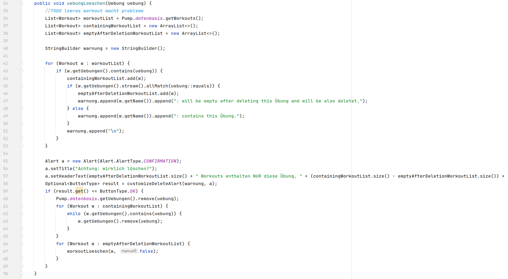

Um diese Methode lesbarer zu machen, wurden Codezeilen in extra Methoden extrahiert.

.RootController.java after
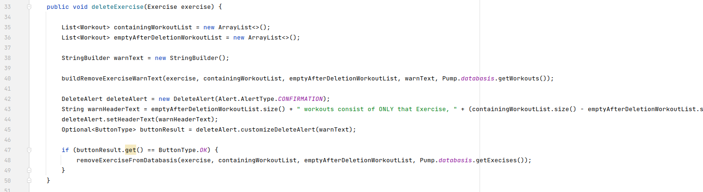

Der Vorgang des tatsächlichen Entfernens der Übung aus der Datenbasis und der Vorgang des Ermittelns in welchen Workouts diese Übung enthalten ist, wurden ausgelagert.

.RootController.java after
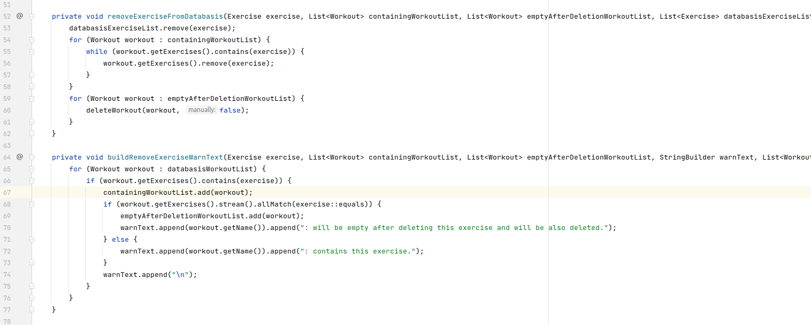

Es wurden an ein paar weiteren Stellen Methoden extrahiert.
Zudem wurden alle Variablen- und Methodennamen sowie Texte in der Benutzeroberfläche auf Englisch umgestellt.
Im Zuge der kompletten Umstellung auf Englisch wurden einigen Methoden auch neue Namen gegeben.
Es wurden zum Beispiel Abkürzungen entfernt und eine vollständigere Beschreibung ihrer Aufgabe verwirklicht.
Hiess eine Methode im `WorkoutController` zuvor beispielsweise `uebungEntfernen()`, sagte dieser Name nicht eindeutig ob eine Übung aus der Datenbasis oder einem Workout entfernt wird.
Der neue Name `removeExerciseFromWorkout()` ist klarer.

.WorkoutController.java git diff
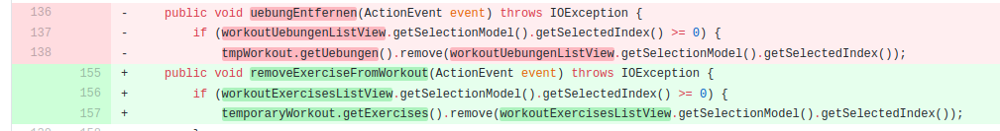

Alle vorgenommen Änderungen sind in diesem link:https://github.com/zeno420/pump/commit/c658070937cdb2af43df12937d2500cd972d8ff0[commit] zu sehen.
