// Header of this document:

= Advanced Software Engineering - Dokumentation
:toc:
:toc-placement: preamble
:toclevels: 4

Eigenständigkeitserklärung: Hiermit erkläre ich, dass ich die vorliegende Arbeit selbstständig verfasst und keine anderen als die angegebenen Quellen und Hilfsmittel benutzt habe.Alle sinngemäß und wörtlich übernommenen Textstellen aus fremden Quellen wurden kenntlich gemacht.

== pump
Mit der pump Desktopanwendung lassen sich einfach persönliche Trainingspläne erstellen. Das eigene Training lässt sich individuell gestalten, ohne dabei abhängig von Übungsangeboten von etablierten Anbietern zu sein.

=== Grundlagen
In pump lassen sich Übungen erstellen. Diese bestehen aus einem Namen, einer optionalen Beschreibung and Sätzen für die Masse- und Definitionsphase. Sätze setzen sich aus der Wiederholungsanzahl und dem Arbeitsgewicht zusammen. Anschließend können Workouts erstellt werden, denen neben einem Namen und einer Beschreuíbung beliebig viele Übungen, auch einzelne mehrfach, hinzugefügt werden können. Um nun ein Trainingsplan, im folgenden Programm, zu kreieren werden diesem Tage hinzugefügt, die aus Workouts bestehen.

Programme lassen sich anschließend ausführen. Während dem ausführen ist es möglich die Sätze der Übungen anzupassen, falls entsprechende Vortschritte dies erfordern. Außerdem lässt sich mit einem Knopfdruck einfach zwischen der Masse- und Definitionsphase wechseln. So müssen, die Phase betreffende, Gewichts- und Wiederholungsänderungen nicht direkt in den Sätzen immer wieder vorgenommen werden.

Um das Persönliche Trainingsverhalten beobachten zu können werden durchtgeführte Workouts und Übungen in ein Logbuchgeschrieben um anschließend dem Anwender aufgeschlüsselt dargestellt werden zu können.

==== Verwendete Bibliotheken
Neben Java wurden für den Programmentwurf JavaFX und JUnit verwendet. In diesem Abschnit wird erläutert warum gerade diese.

===== JavaFX
TODO

===== JUnit
TODO

===== Mockito
TODO

==== Aufbau
TODO

=== Programmierprinzipien
TODO

==== SOLID
TODO

===== Single-responsibility principle
TODO bildüberschriften "Klasse.funktion()"

Für meine Klasse Datenbank gab es mehrere Gründe sie zu bearbeiten. Ein Grund wäre eine Veränderung der Datenbasis, ein weiterer eine Änderung der Routine beim speichern oder laden der Daten.

image::doc/screenshots/Datenbank_0.png[]

Um nun das single-responsibility Prinzip umzusetzen wird die Logik der Datenbasis aus der Klasse extrahiert. Die Datenbank Klasse lädt und speichert nun lediglich eine Datenbasis. Die Struktur der Datenbasis befindet sich in der Klasse Datenbasis.

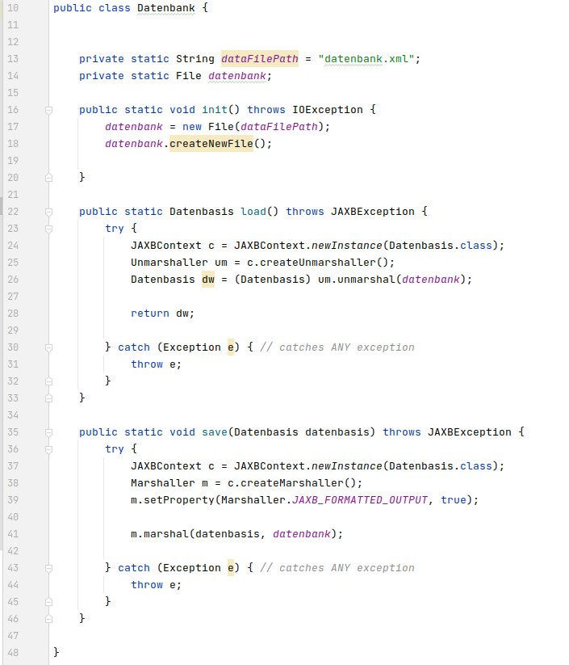

Hier der zugehörige link:https://github.com/zeno420/pump/commit/55e2463a3013b87e0f49d280a61823e3f4b1fb3b[commit].

===== Open–closed principle
TODO bildüberschriften "Klasse.funktion()"

Ein Programm enthält veränderbare Member, wie den Namen, die Beschreibung und die Liste der Tage. Im ProgrammController wird beim drüken des Speicherknopfes die Funktion programmSpeichern() aufgerufen. Diese überprüft die Member des beim Start des Bearbeiten oder Erstellen eines Programms erzeugten temprären Programm auf korrektheit und überträgt die Werte der Memebr anschließend auf das tatsächliche Programm. (zeile 100 bis 102)

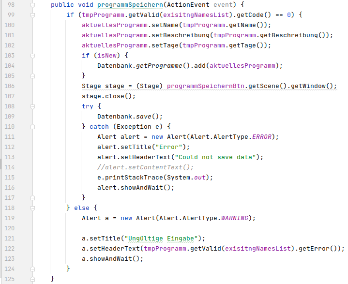

Wollte man einem Programm ein weiteren Member hinzufügen, so müsste auch diese stelle im Code überarbeitet werden. Um das open-closed Prinzip hier zu unserem Vorteil zu nutzen wird in der Klasse Programm eine List erzeugt, welche alle änderbaren Member beinhaltet, also alle, auf die beim Erstellen oder Bearbeiten zugegriffen werden.

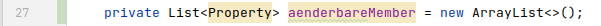
image::doc/screenshots/programmSpeichern_1_4.png[]

Eine neue Funktion "aenderbareMemberUebertragen(List<Property> tmpAenderbareMember)" iteriert nun über all diese Felder und überträggt die Werte.

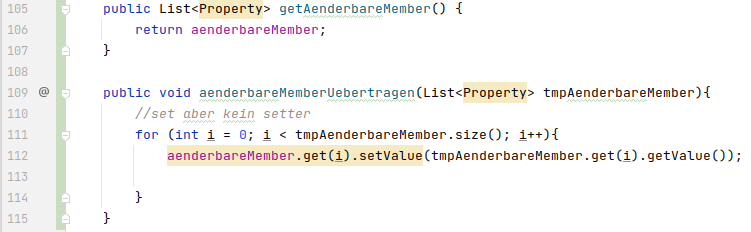

In "programmSpeichern()" muss nun nur noch die Funktion zum Übertragen aufgerufen werden.

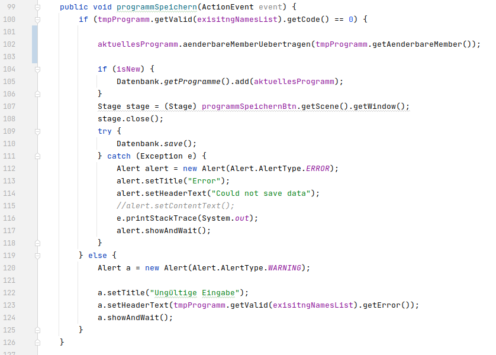

Somit kann in Programm einfach die Liste der Member erweitert werden ohne programmSpeicher() im ProgrammController ändern zu müssen. Hier der zugehörige link:https://github.com/zeno420/pump/commit/7f2e49c88027a5826853e37daa7ffb2067a33d93[commit].

===== Liskov substitution principle
TODO keine abgeleiteten klassen/ property als beispiel zum beweis dass verstanden/ listcell

===== Interface segregation principle
TODO

===== Dependency inversion principle
TODO bildüberschriften "Klasse.funktion()"

In der Statistik Klasse wurden den Funktionen, die Listen von Logeinträgen nach gewissen Kriterien zusammenfassen, initial mit einer ObservableList als parameter aufgerufen.

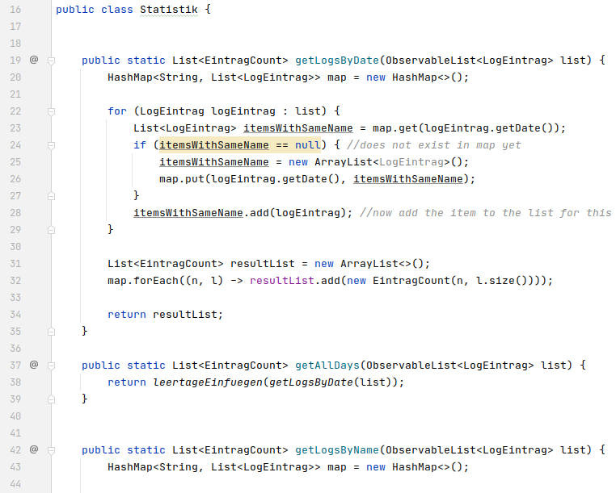

Dependency inversion fordert, dass auf das abstrakteste Level abgestuft wird. Die Funktionen werden jetzt also mit List als parameter aufgerufen.

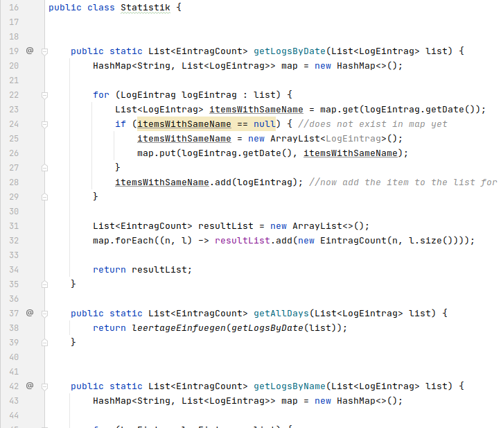

==== GRASP
TODO

===== Low Coupling
TODO bildüberschriften "Klasse.funktion()"

Das Abspeichern einer Übung fand im ÜbungController statt.

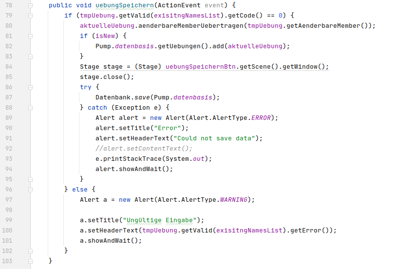

Dort brauchte es Wissen aus der Übung Klasse 

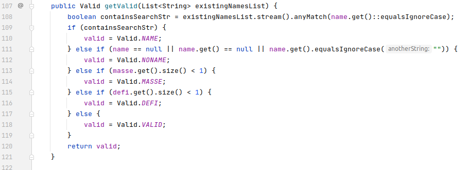

und eine Liste mit Namen der bereits existierenden Übungen.

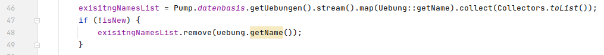

Die Verantwortung zum Abspeichern, also in die Datenbasis eintragen, liegt eher bei der Datenbasis selbst.

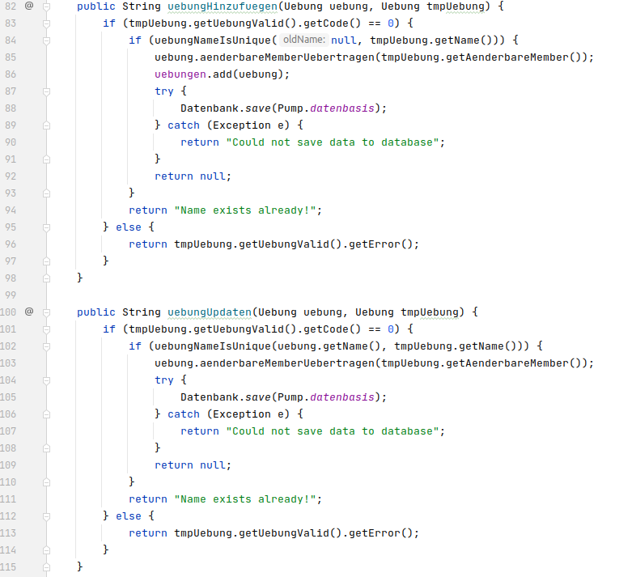

In der Datenbasis ist ebenfalls das wissen über die bereits existierenden Übungen, also wird hier die Namenskollision geprüft.

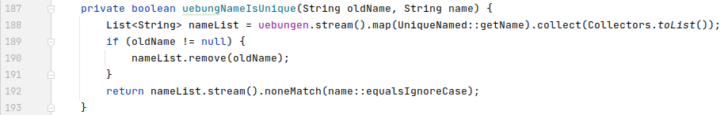

Im Controller wird nun nur noch die hinzufügen() und updaten() Funktion aufgerufen.

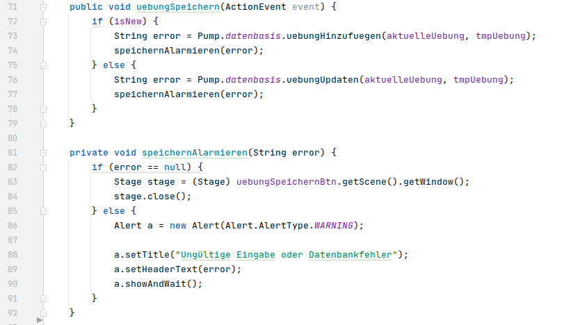

Die Validierung innerhalb der Übung selbst beinhaltet nurnoch die Prüfungen, die auf internens Wissen der Übung basieren.

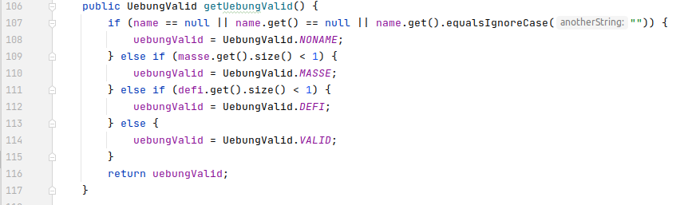

Hier der zugehörige link:https://github.com/zeno420/pump/commit/e28d6914da42028e8ae67a6eacfa08adb5d58ee4[commit].

===== High Cohesion
TODO bildüberschriften "Klasse.funktion()"

Um die Kohäsion zu steigern soll beispielsweise vermieden werden, einer Domainklasse, semantisch zu weit enfernten Code hinzuzufügen. In der Klasse EintragCount befand sich die Funktion keyLexikographischKleiner(),

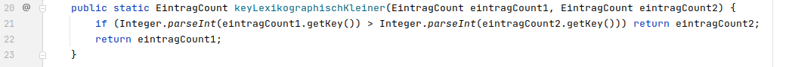

die in der Satistik Klasse dazu verwendet wurde, den Eintrag mit dem frühsten Datum zu ermitteln.

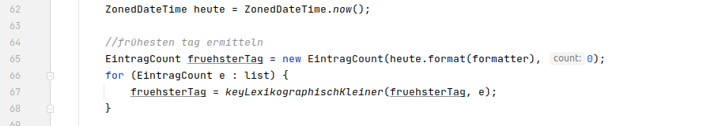

Diese Funktionalität wird in einen Comparator namens EintragCountKeyComparator ausgelagert.

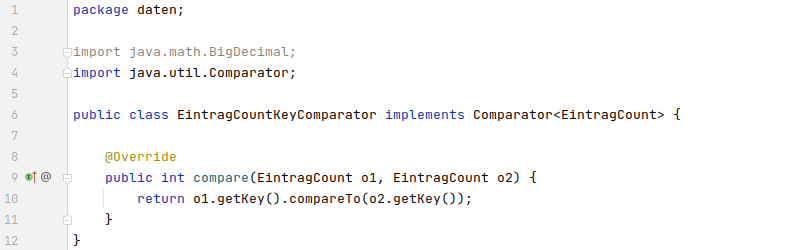

Mit diesem Comparator wird anschließend die Liste Sortiert und auf das Element mit dem Index 0 zugegriffen.

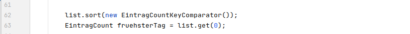

Um Listen von EintragCount nach weiteren Kriterien zu sortieren muss nun lediglich ein entsprechender Comparator hinzugefügt werden. Hier der zugehörige link:https://github.com/zeno420/pump/commit/540f6c38374af922ae780dac809f66685cfa15e6[commit].

==== DRY
TODO bildüberschriften "Klasse.funktion()"

Oft integrieren IDEs statische Codeanalyse. Bei IntelliJ IDEA ist dies der Fall. Diese Analyse zeigt einem einige Stellen auf, an denen duplicated Code existiert. Dies ist in dem nachfogenden Bild in Zeile 82, als eine graue Unterkringelung, zu sehen.

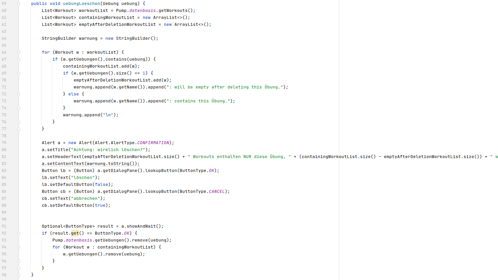

Der Code wiederholt sich ab Zeile 158.

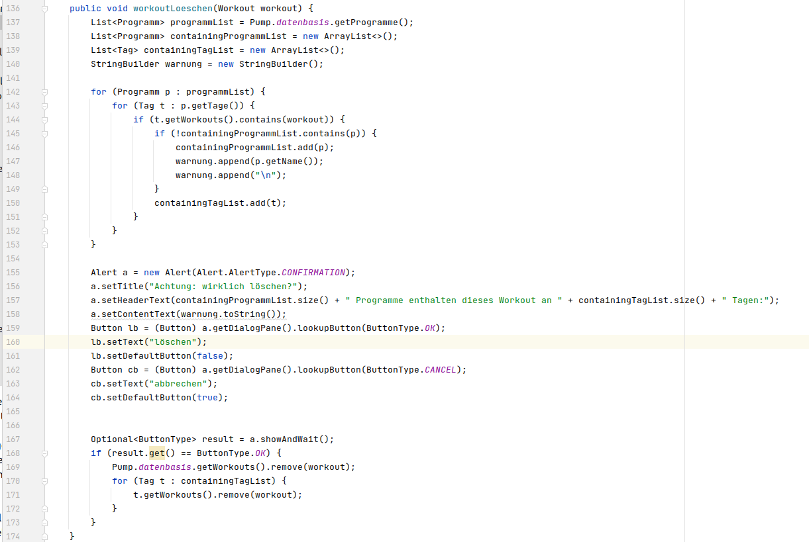

In manchen Fällen wird sogar eine automatische Extraktion des Codestückes geboten.

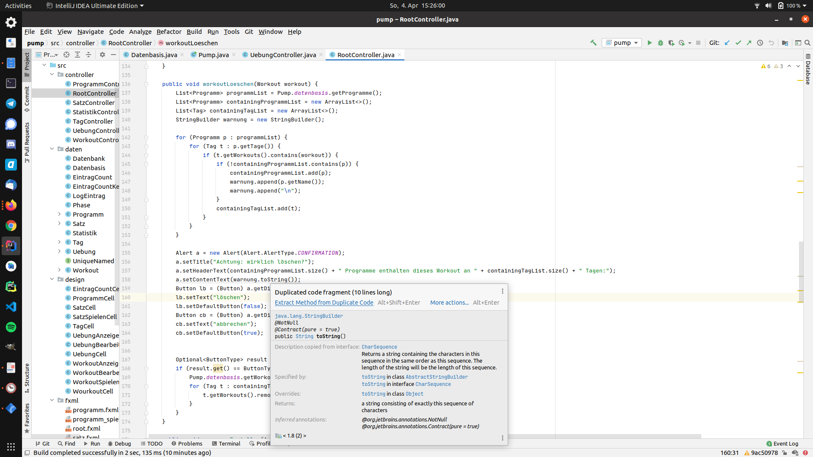

Das Codestück wirde in die customizeDeleteAlert() Funktion ausgelagert und die variablen Teile übergeben.

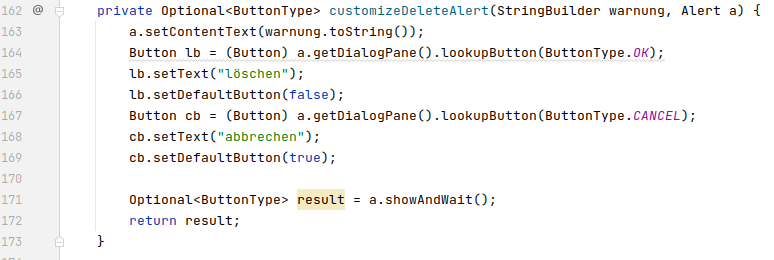

Diese Funktin wird nun an den Stellen aufgerufen, wo vorher gleicher Code stand.

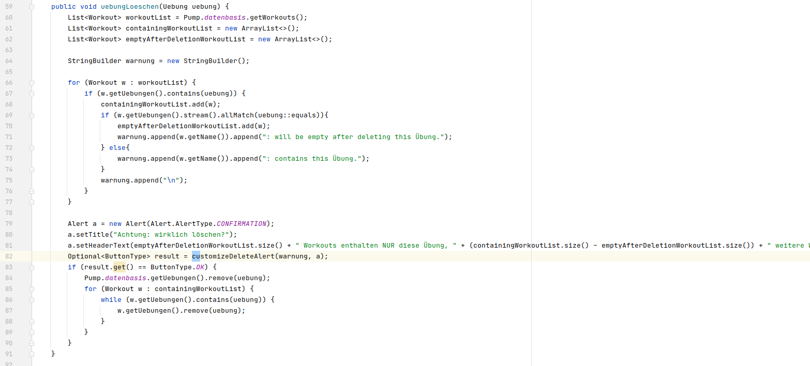
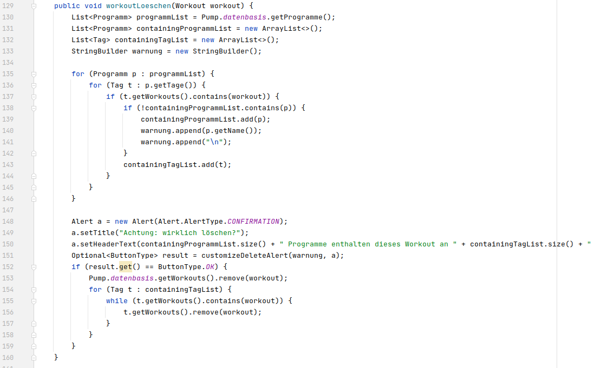

Wiederholungen von Code ziehen sich oft durch das ganze Projekt. Vorangegangenes Beispiel war nur ein Fall von vielen. Im Zuge des zugehörigen link:https://github.com/zeno420/pump/commit/ba45d2b46b9a109049c786512d07fc08af8861db[commits] wurde die Anzahl der Codezeilen von 2256 auf 2220 verringert.

=== Entwurfsmuster
TODO

==== Builder Pattern
TODO bildüberschriften "Klasse.funktion()"

Möchte man in der Satrtansicht der Anwendung ein neues Prgramm, Workout oder eine nue Übung erstellen, oder ein Bestehendes Objekt bearbeiten, wird bei Dürcken des entsprenden Knopfes, im RootController die zugehörige Funktion aufgerufen. diese sechs verschiedenen Funktionen folgen immer dem gleichen Schema: Ein neuer Dialog wird aus einer fxml Resource erstellt, ein Name für diesen Dialog gewählt und der für den Dialog zukünftig zuständige Controller mit dem zu bearbeitenden Objekt initialisiert (setUpBingingEdit()). Vereinfacht gesagt, es wird immer der Editierdialog *gebaut*. Hier bietet es sich an ein Entwurfsmuster vom Typ Erzeuger anzuwenden. Genauer, das Builder Pattern.

Um aus den, als Beispiel dienenden, Funktionen programmBearbeiten() und programmErstellen() den, zusätzlich noch DRY verletzenden, Dialogaufbaucode zu entfernen wird eine neue Klasse, EditDialogBuilder, geschrieben. Diese besitzt Member, die den zuvor zwischen programmBearbeiten() und programmErstellen() unterschiedlichen Aufrufen entsprechen. Für diese Member gibt es Setter, die den Wert nicht nur setzen, sondern auch *this*, also den EditDialogBuilder wieder zurrückgeben. Damit wird erreicht, dass die "konfiguration" des Builders in einem verketteten Statement erfolgen kann. Abschließend wird die funktion build() aufgerufen, die den Bau des Dialogs vornimmt.

Da für Workout und Übung die Routine nahezu identisch ist, wird jetzt der EditDialogBuilder noch generisch gemacht. Dies bedarf die Hilfsinterfaces EditableDomainObject, welches von Programm, Workout und Übung implementiert wird und SetupableController, welches von Programm-, Workout, und Übungscontroller implementiert wird.

Zuvor hängt der RootController, aus dem die erstellen und bearbeiten Funktionen aufgerufen werden,  noch von der setUpBingingEdit() Funktion des Programm-, Workout, und Übungscontrollers ab.

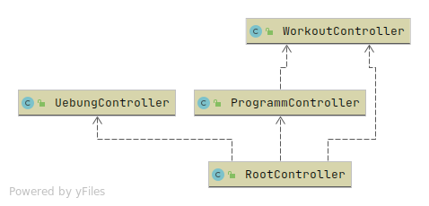
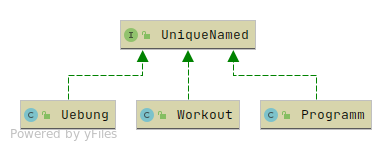

Nach der Implementierung des EditDialogBuilders hängt der Rootcontroller nurnoch von dem Builder ab. Der Builder wiederrum von der setUpBingingEdit() Funktion eines SetupableControllers. EditableDomainObject ist lediglich ein Markierungsinterface. SetupableController stellt sicher, dass ein Controller über die setUpBingingEdit() Funktion verfügt.

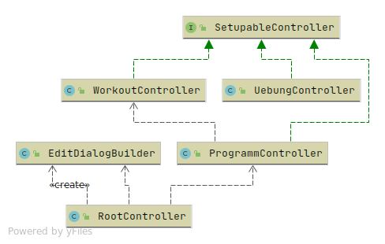
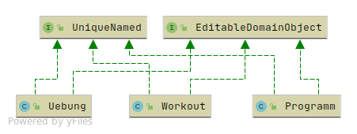

Die weiterhin bestehende Abhängigkeit des RootControllers auf den ProgrammController ist einer anderen Codestelle geschuldet. In diesem link:https://github.com/zeno420/pump/commit/e564a17be6bebdf4caffedf6ed3861efed9a5167[commit] können alle, im Zuge der Implementierung des Builder Patterns für Programme, vorgennommenen Änderungen eingesehen werden. In diesem link:https://github.com/zeno420/pump/commit/bd64481cd97d911d30e35034710d8595d6a9ebd9[commit] die Änderungen für die Generifizierung.

=== Domain Driven Design
TODO

==== Analyse der Ubiquitous Language
TODO nomol abchecken ob das was gewollt ist

In der Domäne Training oder auch Pumpen (*pump*) existieren Trainingsprogramme (*Programm*). Diese Programe können erstellt (*erstellen*), verändert (*bearbeiten*), verworfen (*löschen*) und ausgeführt (*spielen*) werden. Programme bestehen aus einem eindeutigen Namen (*Name*), einer Beschreibung (*Beschreibung*) und einer beliebigen Anzahl von Tagen (*Tag*). Tage können erstellt (*erstellen*), verändert (*bearbeiten*) und verworfen (*löschen*) werden. Tage bestehen aus einem Namen (*Name*), einer Beschreibung (*Beschreibung*) und einer beliebigen Anzahl von Workouts (*Workout*). Workouts können erstellt (*erstellen*), verändert (*bearbeiten*), verworfen (*löschen*) und ausgeführt (*spielen*) werden. Workouts bestehen aus einem eindeutigen Namen (*Name*), einer Beschreibung (*Beschreibung*) und einer beliebigen Anzahl von Übungen (*Übung*). Übungen können erstellt (*erstellen*), verändert (*bearbeiten*) und verworfen (*löschen*) werden. Übungen bestehen aus einem eindeutigen Namen (*Name*), einer Beschreibung (*Beschreibung*) und einer beliebigen Anzahl von Sätzen (*Satz*).

TODO masse defi set logik

Sätze können erstellt (*erstellen*), verändert (*bearbeiten*) und verworfen (*löschen*) werden. Sätze bestehen aus einer Wiederholungsanzahl (*Wiederholungen*) und einem Arbeitsgewicht (*Gewicht*). Zudem ist beim Training die Unterscheidung zwischen der Masse- und Definitionsphase (*Phase*) wichtig.

TODO statistik

==== Analyse und Begründung für Repositories
TODO

==== Analyse und Begründung für Aggregates
TODO versteh ich ned

==== Analyse und Begründung für Entities
Die Domainobjekte Übung, Workout und Programm sind Entitäten. Ihre Identität wird über eine eindeutige ID bestimmt. Zwei Übungen mit der gleichen Zusammensetzung von Sätzen sind trotzdem unterschiedliche Übungen. Die Sätze einer Übung können während des Lebenszyklus der Übung verändert werden, die Übung bleibt die selbe.

==== Analyse und Begründung für Value Objects
Die Domainobjekte Satz und Tag sind Value Objects. Bei ihnen ist nur der Wert ihrer Attribute wichtig. Ein Satz teilt dem Nutzer mit wieviel Wiederholungen mit welchem Gewicht er zu machen hat. Sätze sind zwar in der Ubiquitous Language änderbar (*bearbeiten*), wird so eine Änderung jedoch vorgenommen wird der bearbeitete Satz durch einen neuen mit den neuen Werten ersetzt. Bei Tagen genau so. Sätze und Tage sind also immutable.

=== Architektur
TODO

==== Schichtenarchitektur
Durch die Verwendung von JavaFX enstand automatisch schon eine 2-Schichtenarchitektur, aufgeteilt in die Anzeigeschicht/GUI und die Domainschicht. Die, äußere Schicht, die Anzeigeschicht besteht aus den Controllern, den speziellen ListCells, den fxml Dateien und dem Hauptprogramm.

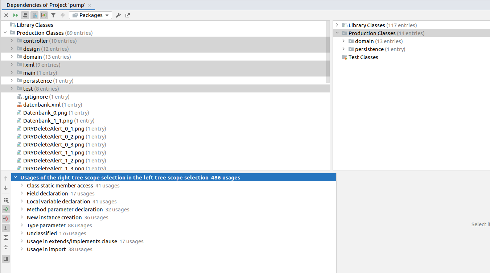

Die Controller sind dafür zuständig, die Interaktion des Benutzers mit der Geschäftslogik zu visualisieren. Ändert sich etwas in der Domainschicht kann es vorkommen, dass die Anzeigeschicht angepasst werden muss. Wird etwas in der GUI geändert kann es nicht vorkommen, dass die Domainschicht angepasst werden muss. Die Domainschicht beinhaltet die Domainklassen, in denen die Geschäftslogik steckt.

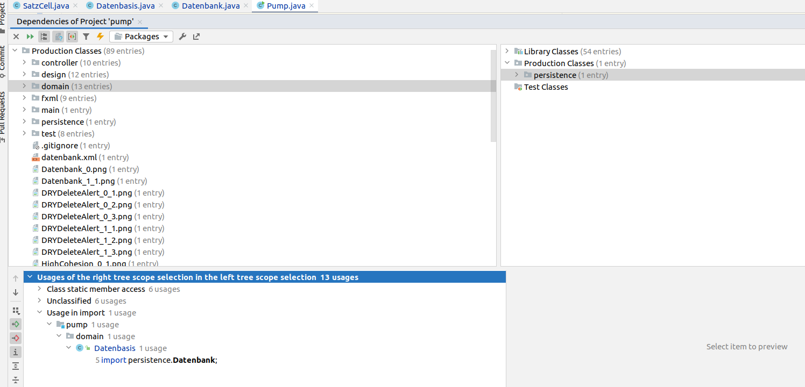

Um die Anwendung sinnvoll nutzen zu können fügen wir noch eine dritte, innerste Schicht hinzu. Die Persistenzschicht soll dafür sorgen Daten zu speichern, zu persistieren. Die Persistenz wird mit dem Modul javax.xml.bind.* umgesetzt. Durch Annotations in der Domainklasse Datenbasis werden alle zu speichernden Datensätze in der Klasse Datenbank in ein xml-File geschrieben. Eine Änderung in der Domainschicht fordert zwar gegebenenfalls eine anpassung der Annotations, bzw der Datenbasis, da diese jedoch noch zur Domainschicht selbst gehört, werden die Abhängigkeitsregeln nicht verletzt. Die Persistenzschicht besteht lediglich aus der Datenbankklasse und dem erzeugten xml-File. Änderungen in der Datenbank Klasse können Anpassungen in den äußeren Schichten erfordern, das xml-File sollte nicht händisch geändert werden.

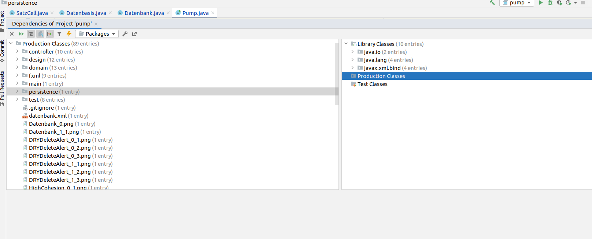

Die Verwendung einer 3-Schichtenarchitektur aus Anzeige-, Domain-, und Persistenzschicht begründet sich dadurch, dass die Persistierung unabhängig von der Anzeige- und Domainlogik sein soll und die Domainlogik unabhängig von der Art wie sie Angezeigt wird sein soll. Für die Visualisierung der Abhängigkeiten zwischen den Packages einer Schicht und dem Rest wurde der Dependency Viewer von IntelliJ genutzt.

=== Unit Tests
TODO JUnit

==== ATRIP
TODO

===== Automatic
TODO bildüberschriften "Klasse.funktion()"

Die Kombination aus IntelliJ und JUnit erlaubt die Ausführung aller Tests in einem Ordner, Projekt oder einer Klasse mit nur einem Knopfdruck. Außerdem lässt sich bei der Ausführungskonfiguration ein "Before launch" Block angeben. In diesem habe ich meine Testrun Konfiguration eingebunden. Vor dem Ausführen meiner Desktopanwendung werden also die Test durchgeführt und bei einem Fehlschlag eines Tests die Anwendung nicht gestartet.

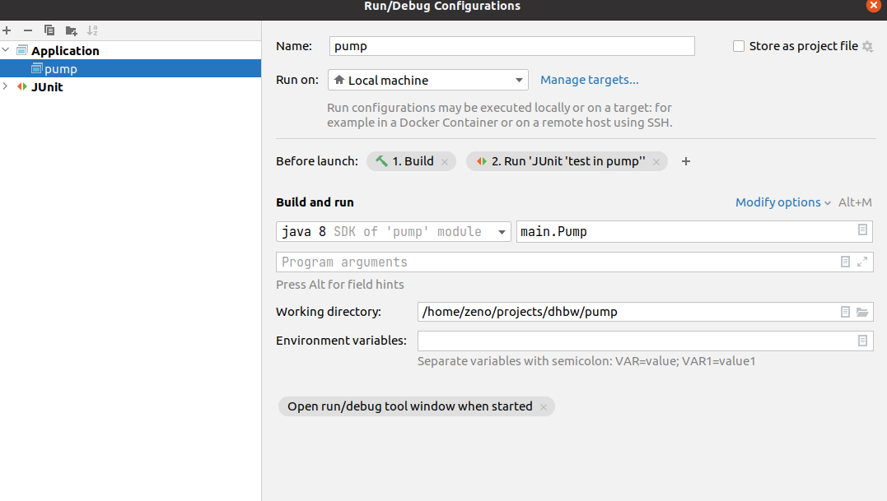

===== Thorough
Da dieser Aspekt im "Ermessen des Entwiclers" liegt ist hier nichts zu beweisen. Es sei allerdings gesagt, dass meine Menge an Tests, zum Zeitpunkt der Abgabe, noch nicht vollständig ist.

===== Repeatable
Da Java schon die Plattformunabhängigkeit liefert, wird davon ausgegangen, dass die Tests dies ebenfalls erfüllen. Von Zeit oder Zufall hängen in diesem Projekt keine Funktionenn ab. In einem anderen privaten Projekt ist Zufall eine Komponente eienr Funktion, um diese sinvoll zu Testen wird die Zufallszahl hard gecoded. 

Um die EditDialogBuilder Klasse zu testen, musste das FXToolkit initialisiert werden. Dies geht nur in einem FXThread. Das in einer Testklasse, die nicht in einer JavaFX Klasse/Umgebung läuft, umzusetzen bedarf der manuellern Erzeugung eines FXThreads. Die Asserts, die die zu testenden Funktionen der EditDialogBuilder Klasse aufrufen, müssen an den FXThread übergeben werden. Die geworfenen Exceptions zurück an den TestThread. Die Synchronisation der beiden Threads ist eine Fehlerquelle. Um die Synchronisation zu gewährleisten, wwerden Semaphore benutz, die released und accquired werden. Der Link zur link:https://github.com/zeno420/pump/blob/edb2e0a5a7b74bbbccd2bbe53adc16936f9c245f/src/test/EditDialogBuilderTest.java[EditDialogBuilderTest] Klasse.

===== Independent
Damit Tests sich nicht beeinflussen wurden Globale Variablen, veränderbarer Listen oder Objekte, in Testklassen weitestgehend vermieden.

===== Professional
Getter und Setter wurden abgesehen von der EditDialogBuilder Klasse (Builderpatter gehört halt dazu) nicht getestet. DRY wird in manchen Tests etwas verletzt um die Independence der einzelnen Testfunktionen zu gewährleisten.

==== Code Coverage
TODO bildüberschriften "Klasse.funktion()"

IntelliJ bietet die Möglichkeit bei Tests Coveragedaten zu sammeln. Das default Plugin sammelt Daten bezüglich der getesteten Klassen, Methoden und durchlaufen Codezeilen.

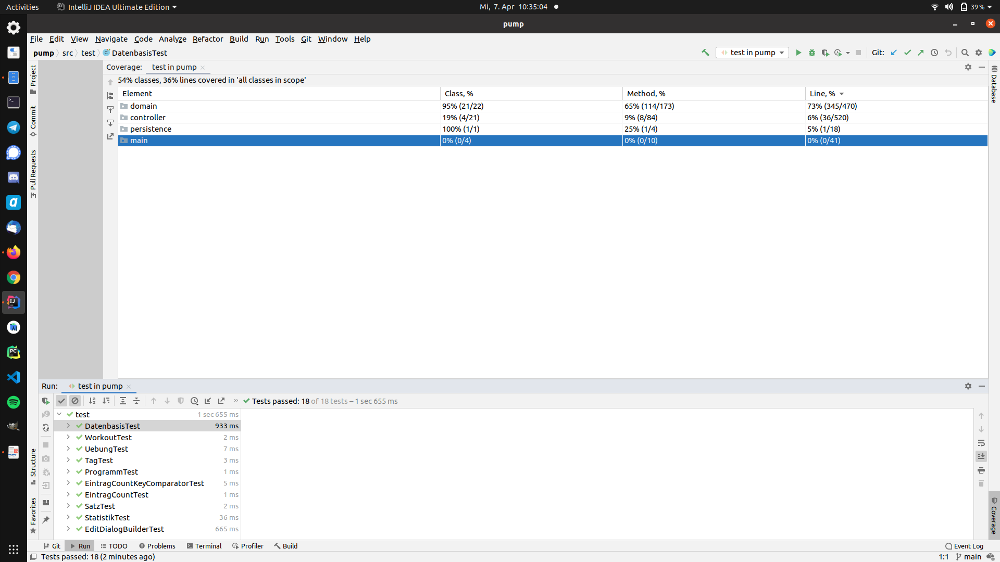

==== Mocks
TODO bildüberschriften "Klasse.funktion()"

Die Domainklasse Datenbasis benutzt in ihren *hinzufügen und *updaten Funktionen die Klasse Datenbank. Genauer, die statische Funktion Datenbank.save(). Da wir Datenbasis unabhängig von Datenbank testen wollen, muss die statische Funktion gemocked werden. Hierfür wird Mockito verwendet.

image::doc/screenshots/Tests_1.png[]

Dies bewirkt, dass beim Aufruf der statischen Funktion save() keine Exception geworfen wird.

=== Refactoring
==== Code Smells
TODO screenshot von codesmell extract meth und name

==== Anwendung und Begründung
