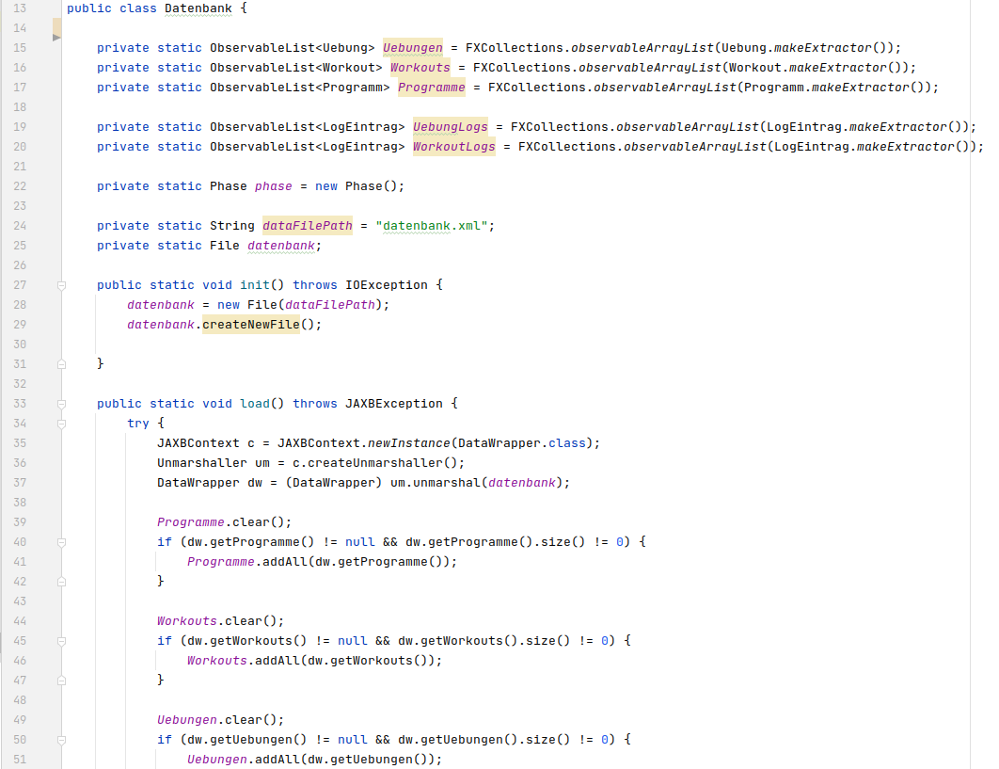

// Header of this document:

Advanced Software Engineering - Dokumentation
=============================================
:toc:
:toc-placement: preamble
:toclevels: 4

Eigenständigkeitserklärung: Hiermit erkläre ich, dass ich die vorliegende Arbeit selbstständig verfasst und keine anderen als die angegebenen Quellen und Hilfsmittel benutzt habe. Alle sinngemäß und wörtlich übernommenen Textstellen aus fremden Quellen wurden kenntlich gemacht.

== pump
Mit der pump Desktopanwendung lassen sich einfach persönliche Trainingspläne erstellen. Das eigene Training lässt sich individuell gestalten, ohne dabei abhängig von Übungsangeboten von etablierten Anbietern zu sein.

=== Grundlagen
In pump lassen sich Übungen erstellen. Diese bestehen aus einem Namen, einer optionalen Beschreibung and Sätzen für die Masse- und Definitionsphase. Sätze setzen sich aus der Wiederholungsanzahl und dem Arbeitsgewicht zusammen. Anschließend können Workouts erstellt werden, denen neben einem Namen und einer Beschreuíbung beliebig viele Übungen, auch einzelne mehrfach, hinzugefügt werden können. Um nun ein Trainingsplan, im folgenden Programm, zu kreieren werden diesem Tage hinzugefügt, die aus Workouts bestehen.

Programme lassen sich anschließend ausführen. Während dem ausführen ist es möglich die Sätze der Übungen anzupassen, falls entsprechende Vortschritte dies erfordern. Außerdem lässt sich mit einem Knopfdruck einfach zwischen der Masse- und Definitionsphase wechseln. So müssen, die Phase betreffende, Gewichts- und Wiederholungsänderungen nicht direkt in den Sätzen immer wieder vorgenommen werden.

Um das Persönliche Trainingsverhalten beobachten zu können werden durchtgeführte Workouts und Übungen in ein Logbuchgeschrieben um anschließend dem Anwender aufgeschlüsselt dargestellt werden zu können.

==== Verwendete Bibliotheken
Neben Java wurden für den Programmentwurf JavaFX und JUnit verwendet. In diesem Abschnit wird erläutert warum gerade diese.

===== JavaFX
TODO

===== JUnit
TODO

==== Aufbau
TODO

=== Programmierprinzipien
TODO

==== SOLID
TODO

===== Single-responsibility principle
TODO bildüberschriften "Klasse.funktion()"

Für meine Klasse Datenbank gab es mehrere Gründe sie zu bearbeiten. Ein Grund wäre eine Veränderung der Datenbasis, ein weiterer eine Änderung der Routine beim speichern oder laden der Daten.

Um nun das single-responsibility Prinzip umzusetzen wird die Logik der Datenbasis aus der Klasse extrahiert. Die Datenbank Klasse lädt und speichert nun lediglich eine Datenbasis. Die Struktur der Datenbasis befindet sich in der Klasse Datenbasis.

image::doc/screenshots/Datenbank_1_1.png[]

Hier der zugehörige link:https://github.com/zeno420/pump/commit/55e2463a3013b87e0f49d280a61823e3f4b1fb3b[commit].

===== Open–closed principle
TODO bildüberschriften "Klasse.funktion()"

Ein Programm enthält veränderbare Member, wie den Namen, die Beschreibung und die Liste der Tage. Im ProgrammController wird beim drüken des Speicherknopfes die Funktion programmSpeichern() aufgerufen. Diese überprüft die Member des beim Start des Bearbeiten oder Erstellen eines Programms erzeugten temprären Programm auf korrektheit und überträgt die Werte der Memebr anschließend auf das tatsächliche Programm. (zeile 100 bis 102)

image::doc/screenshots/programmSpeichern_0.png[]

Wollte man einem Programm ein weiteren Member hinzufügen, so müsste auch diese stelle im Code überarbeitet werden. Um das open-closed Prinzip hier zu unserem Vorteil zu nutzen wird in der Klasse Programm eine List erzeugt, welche alle änderbaren Member beinhaltet, also alle, auf die beim Erstellen oder Bearbeiten zugegriffen werden.

image::doc/screenshots/programmSpeichern_1_3.png[]
image::doc/screenshots/programmSpeichern_1_4.png[]

Eine neue Funktion "aenderbareMemberUebertragen(List<Property> tmpAenderbareMember)" iteriert nun über all diese Felder und überträggt die Werte.

In "programmSpeichern()" muss nun nur noch die Funktion zum Übertragen aufgerufen werden.

image::doc/screenshots/programmSpeichern_1_1.png[]

Somit kann in Programm einfach die Liste der Member erweitert werden ohne programmSpeicher() im ProgrammController ändern zu müssen. Hier der zugehörige link:https://github.com/zeno420/pump/commit/7f2e49c88027a5826853e37daa7ffb2067a33d93[commit].

===== Liskov substitution principle
TODO keine abgeleiteten klassen/ property als beispiel zum beweis dass verstanden/ listcell

===== Interface segregation principle
TODO

===== Dependency inversion principle
TODO bildüberschriften "Klasse.funktion()"

In der Statistik Klasse wurden den Funktionen, die Listen von Logeinträgen nach gewissen Kriterien zusammenfassen, initial mit einer ObservableList als parameter aufgerufen.

image::doc/screenshots/StatistikDI_0.png[]

Dependency inversion fordert, dass auf das abstrakteste Level abgestuft wird. Die Funktionen werden jetzt also mit List als parameter aufgerufen.

image::doc/screenshots/StatistikDI_1_1.png[]

==== GRASP
TODO

===== Low Coupling
TODO bildüberschriften "Klasse.funktion()"

Das Abspeichern einer Übung fand im ÜbungController statt.

Dort brauchte es Wissen aus der Übung Klasse 

image::doc/screenshots/LowCoupling_0_3.png[]

und eine Liste mit Namen der bereits existierenden Übungen.

Die Verantwortung zum Abspeichern, also in die Datenbasis eintragen, liegt eher bei der Datenbasis selbst.

image::doc/screenshots/LowCoupling_1_1.png[]

In der Datenbasis ist ebenfalls das wissen über die bereits existierenden Übungen, also wird hier die Namenskollision geprüft.

image::doc/screenshots/LowCoupling_1_2.png[]

Im Controller wird nun nur noch die hinzufügen() und updaten() Funktion aufgerufen.

Die Validierung innerhalb der Übung selbst beinhaltet nurnoch die Prüfungen, die auf internens Wissen der Übung basieren.

Hier der zugehörige link:https://github.com/zeno420/pump/commit/e28d6914da42028e8ae67a6eacfa08adb5d58ee4[commit].

===== High Cohesion
TODO bildüberschriften "Klasse.funktion()"

Um die Kohäsion zu steigern soll beispielsweise vermieden werden, einer Domainklasse, semantisch zu weit enfernten Code hinzuzufügen. In der Klasse EintragCount befand sich die Funktion keyLexikographischKleiner(),

die in der Satistik Klasse dazu verwendet wurde, den Eintrag mit dem frühsten Datum zu ermitteln.

image::doc/screenshots/HighCohesion_0_2.png[]

Diese Funktionalität wird in einen Comparator namens EintragCountKeyComparator ausgelagert.

Mit diesem Comparator wird anschließend die Liste Sortiert und auf das Element mit dem Index 0 zugegriffen.

Um Listen von EintragCount nach weiteren Kriterien zu sortieren muss nun lediglich ein entsprechender Comparator hinzugefügt werden. Hier der zugehörige link:https://github.com/zeno420/pump/commit/540f6c38374af922ae780dac809f66685cfa15e6[commit].

==== DRY
TODO bildüberschriften "Klasse.funktion()"

Oft integrieren IDEs statische Codeanalyse. Bei IntelliJ IDEA ist dies der Fall. Diese Analyse zeigt einem einige Stellen auf, an denen duplicated Code existiert. Dies ist in dem nachfogenden Bild in Zeile 82, als eine graue Unterkringelung, zu sehen.

image::doc/screenshots/DRYDeleteAlert_0_1.png[]

Der Code wiederholt sich ab Zeile 158.

image::doc/screenshots/DRYDeleteAlert_0_2.png[]

In manchen Fällen wird sogar eine automatische Extraktion des Codestückes geboten.

Das Codestück wirde in die customizeDeleteAlert() Funktion ausgelagert und die variablen Teile übergeben.

image::doc/screenshots/DRYDeleteAlert_1_3.png[]

Diese Funktin wird nun an den Stellen aufgerufen, wo vorher gleicher Code stand.

image::doc/screenshots/DRYDeleteAlert_1_2.png[]

Wiederholungen von Code ziehen sich oft durch das ganze Projekt. Vorangegangenes Beispiel war nur ein Fall von vielen. Im Zuge des zugehörigen link:https://github.com/zeno420/pump/commit/ba45d2b46b9a109049c786512d07fc08af8861db[commits] wurde die Anzahl der Codezeilen von 2256 auf 2220 verringert.

=== Entwurfsmuster
==== Dependency Injection

=== Domain Driven Design
==== Analyse der Ubiquitous Language
==== Analyse und Begründung für…
===== Repositories
===== Aggregates
===== Entities
===== Value Objects

=== Architektur
==== 3-Schicht-Architektur

=== Unit Tests
==== ATRIP
==== Code Coverage
==== Mocks

=== Refactoring
==== Code Smells
==== Anwendung und Begründung
