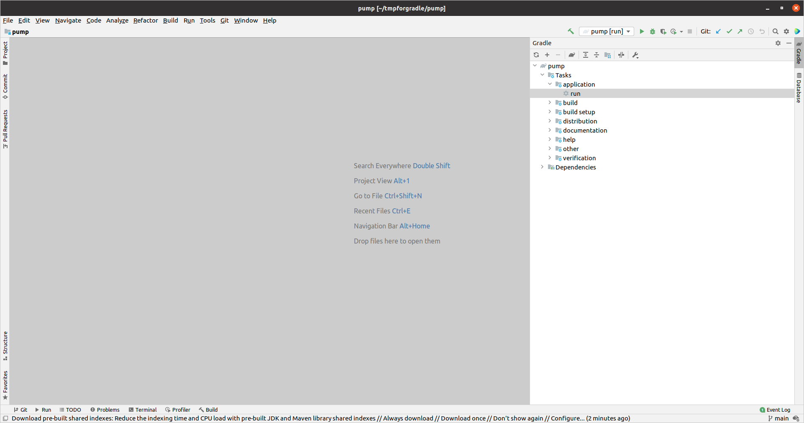

## build & run
###1 clone
- clone this repo (`git clone https://github.com/zeno420/pump.git`)

###2 gradle
```
cd pump
./gradlew run
```

###2 IntelliJ IDEA
- open cloned repository as new project, just select the directory "pump"
- gradle will get you all the needed libraries
- in the gradle task menu, on the upper right, you can run the code
- right click "run" shown in the screenshot below
- then click "Run"



## install
`sudo dpkg -i pump_<version>.deb`
`/opt/pump/bin/pump` or via shortcut/gui